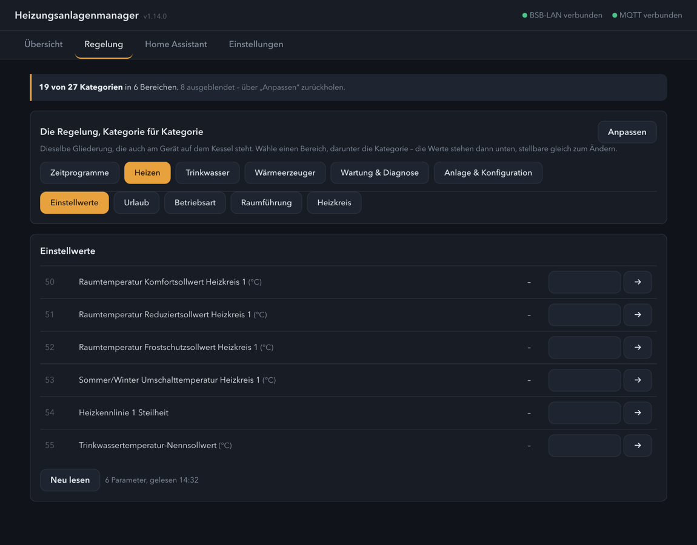

# Heizungsanlagenmanager · Heating System Manager

Ein Home-Assistant-Add-on, das eine Heizungsregelung über
[BSB-LAN](https://github.com/fredlcore/BSB-LAN) bedienbar macht – mit
derselben Gliederung, die auch am Gerät auf dem Kessel steht.

[](https://my.home-assistant.io/redirect/supervisor_add_addon_repository/?repository_url=https%3A%2F%2Fgithub.com%2FMelle79%2FHA-heizungsanlagenmanager)
[](https://buymeacoffee.com/melle79)

> 📖 Ausführliche Anleitung: **[DOCS.de.md](heizungsanlage/DOCS.de.md)** ·
> 🇬🇧 In English: **[README.md](README.md)**

Die Oberfläche folgt der Spracheinstellung von Home Assistant – **Deutsch und
Englisch**. Was die Regelung selbst sagt, bleibt so, wie dein Gerät es führt.


## Was es kann

**Bedienen statt nur anzeigen.** Die Kategorien kommen aus der Regelung
selbst, gruppiert nach dem, was sie tun – Heizen, Trinkwasser, Wärmeerzeuger,
Wartung. Stellbare Parameter bekommen gleich das passende Bedienelement.
Zeitschaltprogramme erscheinen als **Wochentabelle** statt als Zeichenkette,
und darüber steht, ob dieses Programm gerade läuft.

**Eine Übersicht, die du selbst zusammenstellst.** Welche Werte auf der
Startseite stehen, schlägt der Manager aus dem Katalog vor – Reihenfolge,
Beschriftung und Auswahl änderst du mit ein paar Klicks. Der Vorschlag bleibt
einen Knopfdruck weit entfernt.

**Keine fest eingebauten Parameternummern.** Was auf der Übersicht steht,
welche Kategorien Schaltzeiten führen, welcher Parameter das aktive Programm
wählt – alles leitet das Add-on aus dem Katalog *deiner* Anlage ab, aus Namen
und Datentypen. Damit läuft es auf jeder Regelung, die BSB-LAN bedient: BSB,
LPB und PPS.

**Zwei Wege nach Home Assistant.** Entweder meldet das Add-on die ausgewählten
Parameter selbst – oder es richtet BSB-LAN so ein, dass der Adapter es tut,
und hält sich dann heraus. Broker und Zugangsdaten kommen dabei von Home
Assistant selbst; abtippen musst du nichts.


**Und es fragt nicht zweimal.** Meldet BSB-LAN, hört das Add-on dessen Werte
mit, statt dieselben Parameter noch einmal über den Bus zu holen. Jeder
Parameter darf dabei seinen **eigenen Takt** bekommen – die Kesseltemperatur
jede Minute, die Betriebsstunden einmal in der Stunde. Daneben steht, was das
an Buszeit kostet.

**Es sagt Bescheid, wenn es hakt.** Drei Zustände kennt kaum jemand, bis sie
weh tun: Der Adapter antwortet nicht – oder er antwortet und meldet trotzdem
nichts mehr, weil er nach einem Funkabriss in seinem eigenen Zugangspunkt
hängt – oder das Stellen kommt nicht an, und die Anlage behält still, was
zuletzt gesetzt wurde. Das Add-on erkennt beides, meldet es über einen notify-Dienst deiner
Wahl und legt für Automationen zwei Entitäten an. Home Assistant selbst merkt
davon sonst nichts: BSB-LANs Anmeldung kennt kein Verfügbarkeitsthema.

**Ein Protokoll, das kurz bleibt.** Was gestellt wurde und von wem, was
schiefging, wann die Legionellenaufheizung lief, wann der Katalog eingelesen
wurde – die letzten 200 Einträge auf der Übersicht. Keine Abfragetakte: Ein
Protokoll, in dem alles steht, liest niemand.

**Eigene Namen.** Was die Parameterliste falsch benennt – Parameter 70 heißt
dort *Brauchwassertemperatur-Reduziertsollwert* und ist die Betriebsart –,
lässt sich richtigstellen. Der Name gilt in der Oberfläche **und in Home
Assistant**; der ursprüngliche bleibt als Fußnote sichtbar.

**Vorsichtig mit der Anlage.** Stellen geht erst, wenn zwei Schalter stehen –
der in BSB-LAN und der im Add-on, beide ab Werk aus. Der Bus wird in Bündeln
mit Pausen abgefragt, nicht im Dauerfeuer. Und nach jedem Schreiben wird
zurückgelesen: Was das Gerät danach führt, zählt, nicht was ihm geschickt
wurde.



## Voraussetzungen

* Ein laufendes [BSB-LAN](https://github.com/fredlcore/BSB-LAN) im selben Netz
  (entwickelt mit 5.1.18, zuletzt geprüft mit 5.1.21)
* Ein MQTT-Broker in Home Assistant

## Installation

Diese Adresse in Home Assistant als Add-on-Repository hinzufügen
(*Einstellungen → Add-ons → Add-on-Store → ⋮ → Repositories*):

```
https://github.com/Melle79/HA-heizungsanlagenmanager
```

Danach *Heizungsanlagenmanager via BSB-LAN* installieren und starten. Unter
**Einstellungen** die Adresse von BSB-LAN eintragen und den
**Parameterkatalog einlesen** – das dauert ein bis zwei Minuten, weil jede
Kategorie einzeln über den Bus geht. Unter **Home Assistant** anhaken, was als
Entität erscheinen soll.

## Was BSB-LAN dabei beigebracht hat

Ein paar Eigenheiten, die man erst am lebenden Gerät findet – sie stehen hier,
damit der nächste sie nicht noch einmal suchen muss:

* `/JW` nimmt nur `parameter` und `value`. Gibt man den vollständigen Eintrag
  aus `/JL` zurück, antwortet BSB-LAN mit einer leeren Struktur und ändert
  nichts – ohne Fehlermeldung.
* Die Log-Parameterliste fasst **höchstens 40** Einträge. Alles darüber fällt
  stillschweigend weg.
* Auto-Discovery widerrufen (`/M0!<ziel>`) wirkt nur auf das, was gerade in
  der Liste steht. Reihenfolge also: abmelden, Liste ändern, anmelden.
* `/JL` lieferte in 5.1.18 kaputtes JSON, wenn keine One-Wire- oder DHT-Pins
  gesetzt sind. In 5.1.21 ist das behoben – mit abgeschalteten Pins
  nachgeprüft.
* Während eines Parameter-Dumps nimmt BSB-LAN ab 5.1.21 nur noch `/dumpstate`
  an und weist jede andere Verbindung ab. Dauert der Dump lange genug, meldet
  der Manager „Adapter antwortet nicht“ – zu Recht, aber es ist kein Ausfall.

## Selber daran arbeiten

Die Prüfungen laufen ohne Heizung und ohne Home Assistant – BSB-LAN ist darin
gefälscht:

```sh
./pruefen.sh
```

Beim ersten Aufruf legt das Skript sich eine eigene Python-Umgebung unter
`.venv/` an und holt sich, was im Add-on das Dockerfile besorgt.

## Dank

An [Frederik Holst](https://github.com/fredlcore) und alle, die an BSB-LAN
mitgebaut haben. Ohne die angepasste Parameterliste für die eigene
Gerätefamilie wäre aus „Parameter 72" nie „Gerätebetriebsstunden" geworden.

## Haftungsausschluss

Dies ist ein **privates Hobby-Projekt** ohne kommerziellen Hintergrund. Die
Nutzung erfolgt auf eigene Gefahr – **jegliche Haftung ist ausgeschlossen**
(siehe auch MIT-Lizenz). Es findet **kein Support** statt; Issues und Pull
Requests werden möglicherweise nicht beantwortet.

Das gilt hier mit Nachdruck: Das Add-on schreibt auf einen Bus, an dem die
Heizungsregelung eines Hauses hängt. Das Stellen ist deshalb ab Werk
**gesperrt** und muss bewusst freigegeben werden. Ein falscher Sollwert lässt
im Winter eine Wohnung auskühlen – prüft jeden Parameter, bevor ihr ihn
schreibt.

## Lizenz

MIT
