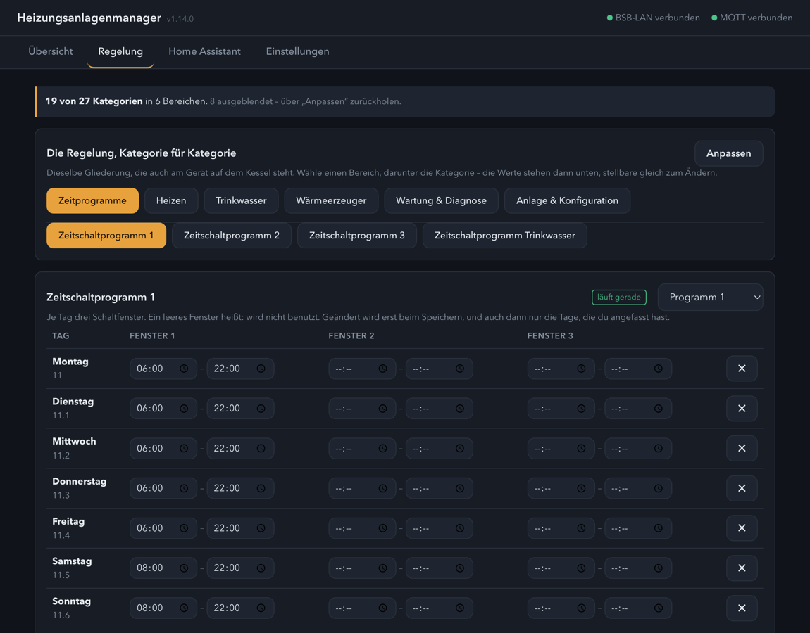
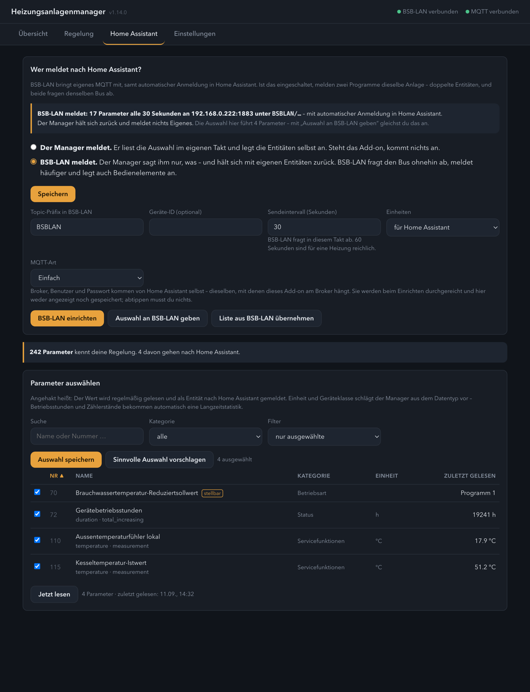

# Heizungsanlagenmanager via BSB-LAN

Ein Home-Assistant-Add-on, das eine Heizungsregelung über
[BSB-LAN](https://github.com/fredlcore/BSB-LAN) bedienbar macht – mit
derselben Gliederung, die auch am Gerät auf dem Kessel steht.

*A Home Assistant add-on that makes a heating controller usable through
BSB-LAN – with the same structure you find on the boiler's own panel.
[Documentation in English](heizungsanlage/DOCS.md).*



## Was es kann

**Bedienen statt nur anzeigen.** Die Kategorien kommen aus der Regelung
selbst, gruppiert nach dem, was sie tun – Heizen, Trinkwasser, Wärmeerzeuger,
Wartung. Stellbare Parameter bekommen gleich das passende Bedienelement.
Zeitschaltprogramme erscheinen als **Wochentabelle** statt als Zeichenkette,
und darüber steht, ob dieses Programm gerade läuft.

**Keine fest eingebauten Parameternummern.** Was auf der Übersicht steht,
welche Kategorien Schaltzeiten führen, welcher Parameter das aktive Programm
wählt – alles leitet das Add-on aus dem Katalog *deiner* Anlage ab, aus Namen
und Datentypen. Damit läuft es auf jeder Regelung, die BSB-LAN bedient: BSB,
LPB und PPS.

**Zwei Wege nach Home Assistant.** Entweder meldet das Add-on die ausgewählten
Parameter selbst – oder es richtet BSB-LAN so ein, dass der Adapter es tut,
und hält sich dann heraus. Broker und Zugangsdaten kommen dabei von Home
Assistant selbst; abtippen musst du nichts.



**Vorsichtig mit der Anlage.** Stellen geht erst, wenn zwei Schalter stehen –
der in BSB-LAN und der im Add-on, beide ab Werk aus. Der Bus wird in Bündeln
mit Pausen abgefragt, nicht im Dauerfeuer. Und nach jedem Schreiben wird
zurückgelesen: Was das Gerät danach führt, zählt, nicht was ihm geschickt
wurde.


## Voraussetzungen

* Ein laufendes [BSB-LAN](https://github.com/fredlcore/BSB-LAN) im selben Netz
  (entwickelt und geprüft mit 5.1.18)
* Ein MQTT-Broker in Home Assistant

## Installation

1. In Home Assistant unter **Einstellungen → Add-ons → Add-on-Store** über das
   Dreipunktmenü **Repositories** hinzufügen:
   `https://github.com/Melle79/HA-heizungsanlagenmanager`
2. *Heizungsanlagenmanager via BSB-LAN* installieren und starten.
3. Unter **Einstellungen** die Adresse von BSB-LAN eintragen und den
   **Parameterkatalog einlesen** – das dauert ein bis zwei Minuten, weil jede
   Kategorie einzeln über den Bus geht.
4. Unter **Home Assistant** anhaken, was als Entität erscheinen soll.

Alles Weitere steht im [Handbuch](heizungsanlage/DOCS.de.md)
([English](heizungsanlage/DOCS.md)).

## Was BSB-LAN dabei beigebracht hat

Ein paar Eigenheiten, die man erst am lebenden Gerät findet – sie stehen hier,
damit der nächste sie nicht noch einmal suchen muss:

* `/JW` nimmt nur `parameter` und `value`. Gibt man den vollständigen Eintrag
  aus `/JL` zurück, antwortet BSB-LAN mit einer leeren Struktur und ändert
  nichts – ohne Fehlermeldung.
* Die Log-Parameterliste fasst **höchstens 40** Einträge. Alles darüber fällt
  stillschweigend weg.
* Auto-Discovery widerrufen (`/M0!<ziel>`) wirkt nur auf das, was gerade in
  der Liste steht. Reihenfolge also: abmelden, Liste ändern, anmelden.
* `/JL` liefert in 5.1.18 kaputtes JSON, wenn keine One-Wire- oder DHT-Pins
  gesetzt sind.

## Selber daran arbeiten

Die Prüfungen laufen ohne Heizung und ohne Home Assistant – BSB-LAN ist darin
gefälscht:

```sh
./pruefen.sh
```

Beim ersten Aufruf legt das Skript sich eine eigene Python-Umgebung unter
`.venv/` an und holt sich, was im Add-on das Dockerfile besorgt.

## Dank

An [Frederik Holst](https://github.com/fredlcore) und alle, die an BSB-LAN
mitgebaut haben. Ohne die angepasste Parameterliste für die eigene
Gerätefamilie wäre aus „Parameter 72“ nie „Gerätebetriebsstunden“ geworden.

## Lizenz

MIT

## Haftungsausschluss

Dies ist ein **privates Hobby-Projekt** ohne kommerziellen Hintergrund. Die
Nutzung erfolgt auf eigene Gefahr – **jegliche Haftung ist ausgeschlossen**
(siehe auch MIT-Lizenz). Es findet **kein Support** statt; Issues und Pull
Requests werden möglicherweise nicht beantwortet.

Das gilt hier mit Nachdruck: Das Add-on schreibt auf einen Bus, an dem die
Heizungsregelung eines Hauses hängt. Das Stellen ist deshalb ab Werk
**gesperrt** und muss bewusst freigegeben werden. Ein falscher Sollwert lässt
im Winter eine Wohnung auskühlen – prüft jeden Parameter, bevor ihr ihn
schreibt.
